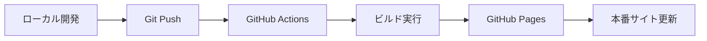

# たにもと建設株式会社 ウェブサイト

## 概要
たにもと建設株式会社の公式ウェブサイトのソースコードです。
GitHub Actions による自動ビルド・デプロイ環境で運用されています。

## 会社概要
- 社名：たにもと建設株式会社
- 設立：昭和38年6月24日
- 資本金：40,000,000円
- 従業員数：42名（令和6年4月1日現在）
- 所在地：神奈川県横浜市中区羽衣町2-7-10 関内駅前マークビル6F

## 技術スタック
- **フロントエンド**: HTML5, CSS3 (SCSS), JavaScript (ES6), jQuery
- **ビルドツール**: Gulp 4.x
- **CI/CD**: GitHub Actions
- **デプロイ**: GitHub Pages
- **API**: Google Maps API

## 開発環境のセットアップ

### 1. 前提条件
- Node.js 18.x 以上
- npm または yarn

### 2. 依存パッケージのインストール
```bash
npm install
```

### 3. 開発用ビルド
```bash
# ワンタイムビルド
npm run build

# ファイル監視付き開発モード
npm run watch
```

## ディレクトリ構成（更新済み）
```
.
├── index.html           # トップページ
├── about_index.html     # 取り組み一覧ページ
├── common/             # 共通アセット
│   ├── scss/          # Sassソースファイル
│   ├── css/           # コンパイル済みCSS
│   ├── js/            # JavaScriptファイル
│   └── font/          # Webフォント
├── imageFile/          # 画像ファイル
│   ├── global/        # 共通画像
│   ├── projects/      # プロジェクト別画像
│   └── works/         # 施工実績画像
├── projects/           # プロジェクトページ
│   ├── 2023/
│   ├── 2024/
│   └── 2025/          # 新年度プロジェクト
├── rookie_diary/       # 新人日記
├── dist/              # ビルド出力（自動生成）
├── .github/workflows/ # GitHub Actions設定
└── gulpfile.js        # ビルド設定
```

## ビルドシステム

### 利用可能なコマンド
```bash
# 本番用ビルド（圧縮・最適化）
npm run build

# 開発用ビルド（ファイル監視付き）
npm run watch

# SCSSコンパイルのみ
npx gulp styles
```

### ビルド処理内容
1. **SCSS → CSS**: Sassコンパイル + Autoprefixer + 圧縮
2. **JavaScript圧縮**: UglifyJS による minify
3. **画像最適化**: ImageMin による画像圧縮（JPEG, PNG, SVG対応）
4. **ファイルコピー**: HTML, フォント, その他アセットをdistフォルダに出力

### 最適化効果
- **JavaScript**: 最大80%サイズ削減
- **画像ファイル**: 最大89%サイズ削減
- **CSS**: SCSS変換 + 圧縮 + ベンダープレフィックス自動付与

## GitHub Actions 自動デプロイ

### 概要
- **トリガー**: `main` または `master` ブランチへのpush
- **処理内容**: 
  1. 依存関係のインストール
  2. ビルド実行
  3. GitHub Pages への自動デプロイ
- **出力**: `dist/` フォルダの内容が `gh-pages` ブランチに自動配信

### デプロイフロー


## 開発ワークフロー

### 1. 新機能開発
```bash
# 1. 最新のmainブランチをpull
git checkout main
git pull origin main

# 2. 機能ブランチを作成
git checkout -b feature/新機能名

# 3. 開発（ファイル監視モードで作業）
npm run watch

# 4. ビルドテスト
npm run build

# 5. コミット・プッシュ
git add .
git commit -m "追加: 新機能の実装"
git push origin feature/新機能名
```

### 2. プレビュー確認
- **ローカル**: `npm run build` 後に `dist/index.html` をブラウザで開く
- **ステージング**: 機能ブランチをpushすると自動でプレビュー環境構築（PR作成時）
- **本番**: mainブランチマージ後、自動でGitHub Pagesに反映

## 注意事項

### 開発時
- **ソースファイル**: ルートディレクトリの `.html`, `common/scss/`, `imageFile/` を編集
- **ビルド前確認**: 必ず `npm run build` でエラーがないことを確認
- **SCSS編集**: `common/scss/` 内のファイルを編集（`common/css/` は自動生成）

### デプロイ時
- **自動デプロイ**: mainブランチへのマージで自動実行
- **手動デプロイ**: 緊急時は GitHub Actions の手動実行も可能
- **ロールバック**: 前のコミットに戻す場合は該当コミットをrevertしてpush

### トラブルシューティング
```bash
# 依存関係の問題
npm ci  # package-lock.jsonを元に再インストール

# ビルドエラー
npm run build 2>&1 | tee build.log  # エラーログを保存

# キャッシュクリア
rm -rf node_modules package-lock.json
npm install
```

## ブラウザ対応
- Google Chrome（最新版）
- Firefox（最新版）
- Safari（最新版）
- Microsoft Edge（最新版）
- Internet Explorer 11
詳細な環境の仕組みは[ENVIRONMENT.md](ENVIRONMENT.md)を参照してください。
## ライセンス
Copyright © Tanimoto Construction Co., Ltd. All Rights Reserved. 
